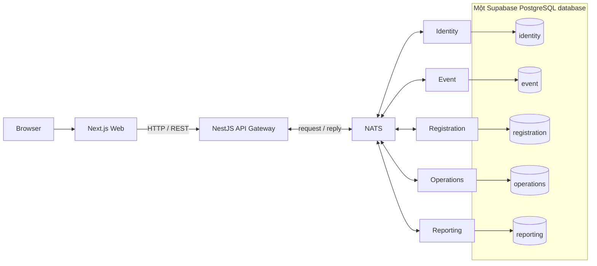

# Event Management System

Hệ thống Quản lý và Điều hành Sự kiện quy mô vừa. Repository là **pnpm monorepo**, backend theo **microservices**, hiện chỉ triển khai **Phase 0 — Foundation**.

Bốn nhóm sản phẩm: đăng ký/vé/check-in, nội dung/chương trình, vận hành/tài nguyên, báo cáo/thống kê. Các nhóm này đang được giới thiệu trên trang chủ; chưa có chức năng nghiệp vụ.

## Kiến trúc



Web chỉ gọi Gateway. Gateway không có Prisma hoặc repository nghiệp vụ. Năm service chạy NATS transport, không mở HTTP port. Mỗi service có schema, Prisma Client và migrations riêng; không JOIN, FK hoặc import source xuyên service.

## Tech stack

- Node.js 22.12+ thuộc dòng 22 hoặc Node.js 24+, pnpm 10.18.2, TypeScript strict.
- Next.js 16, React 19, App Router, Tailwind CSS 4, shadcn/ui foundation.
- TanStack Query, React Hook Form, Zod; chưa cần Zustand.
- NestJS 12, Config, Microservices, NATS, Swagger, ValidationPipe.
- Prisma **7.10.0 stable**, PostgreSQL driver adapter; Supabase chỉ làm managed PostgreSQL.
- JWT signing configuration trong Identity, chưa có đăng ký/đăng nhập.
- ESLint, Prettier, Jest. Phiên bản được khóa bằng `pnpm-lock.yaml`.

Prisma dùng `prisma-client`, output nằm trong từng service, `moduleFormat = "esm"` phù hợp bản build NestJS. URL cho Prisma CLI đặt trong `prisma.config.ts`; URL runtime đi qua `PrismaPg`. Không dùng syntax `url/directUrl` trong datasource của schema Prisma 7.

## Cấu trúc

```text
apps/
  web/                        # Next.js, chỉ gọi REST Gateway
  gateway/                    # HTTP, Swagger, validation, tổng hợp health
services/
  identity-service/
  event-service/
  registration-service/
  operations-service/
  reporting-service/
    prisma/schema.prisma      # Mỗi service đều có cấu trúc Prisma này
    prisma/migrations/
    prisma.config.ts
    src/config/
    src/health/
    src/prisma/
packages/
  contracts/                  # NATS health patterns và response types
  shared/                     # API envelope và environment primitives
docs/
  architecture/
  bounded-contexts/
  api/
  database/
  events/
  sequence-diagrams/
scripts/
```

## Microservice responsibilities

| Service      | PostgreSQL schema | Phạm vi ở các phase tiếp theo                                      |
| ------------ | ----------------- | ------------------------------------------------------------------ |
| Identity     | identity          | Users, roles, permissions, event-scoped RBAC, refresh tokens       |
| Event        | event             | Events, locations, rooms, tracks, sessions, speakers, agenda       |
| Registration | registration      | Attendees, forms, registrations, tickets, QR, check-in             |
| Operations   | operations        | Teams, staff, tasks, documents, equipment, organizations, sponsors |
| Reporting    | reporting         | Read models và metrics riêng, nhận domain events                   |

`packages/contracts` chỉ dành cho Gateway ↔ microservice. Frontend định nghĩa và validate REST response tại data layer riêng. Shared không chứa Prisma, repository hay business entities.

## Cài đặt

Yêu cầu: Node.js, pnpm, Git, NATS server local, một Supabase project nếu kiểm tra database thật.

```sh
pnpm install
pnpm setup:env
```

PowerShell có thể chặn `pnpm.ps1`; khi đó dùng `pnpm.cmd` thay cho `pnpm`. Không cần thay đổi execution policy.

`setup:env` chỉ sao chép example sang các `.env` chưa tồn tại, không ghi đè file đã cấu hình và không tạo secret.

## Environment setup

| Nơi cấu hình               | Biến                                                |
| -------------------------- | --------------------------------------------------- |
| Root .env                  | SMOKE_API_URL, SMOKE_WEB_URL — chỉ cho smoke script |
| apps/web/.env              | NEXT_PUBLIC_API_URL                                 |
| apps/gateway/.env          | PORT, FRONTEND_URL, NATS_URL, HEALTH_TIMEOUT_MS     |
| Mỗi services/*/.env        | NATS_URL, DATABASE_URL, DIRECT_URL                  |
| identity-service/.env thêm | JWT_ACCESS_SECRET, JWT_REFRESH_SECRET               |

Lấy **connection strings thật** từ Supabase Connect. Không dùng Supabase anon key/service-role API key làm database password. Không gửi database URLs sang Web. JWT secrets phải khác nhau, tối thiểu 32 ký tự, được tạo bằng công cụ quản lý secret của bạn.

Ứng dụng dừng sớm nếu thiếu env bắt buộc. Biến runtime của một service không được trỏ `schema=` sang service khác. Root env không tự động truyền cấu hình database xuống các service.

Next.js cần `NEXT_PUBLIC_API_URL` khi dev/build; giá trị này là public và được đóng vào browser bundle. Build backend, unit test, Prisma validate/generate không cần database thật.

## Supabase và Prisma

Dùng **một project / một PostgreSQL database / năm PostgreSQL schemas**. Chạy `scripts/create-schemas.sql` trong Supabase SQL Editor để bootstrap schema. File này chỉ tạo schema, không tạo bảng.

- `DATABASE_URL`: runtime, dùng connection phù hợp môi trường từ Supabase.
- `DIRECT_URL`: dành cho migration; ưu tiên direct connection hoặc session pooler nếu môi trường chỉ có IPv4.
- Prisma CLI tự đặt `schema=<owned-schema>` vào DIRECT_URL và từ chối schema sai.
- Runtime adapter chỉ định schema cố định theo service.
- Giới hạn schema của Prisma **không thay thế PostgreSQL grants**. Dùng role riêng cho từng service, chỉ cấp quyền schema thuộc sở hữu; xem [hướng dẫn Supabase](docs/database/supabase-setup.md).
- Không chạy migration bằng credentials dùng chung có quyền trên tất cả schema.

```sh
pnpm db:validate
pnpm db:generate
```

Phase 0 không có model giả hay business table. Migrations chỉ có lock file; migration nghiệp vụ đầu tiên được tạo khi service có model thật trong phase tương ứng. Không chạy `db push` hoặc `migrate reset` trên database dùng chung.

Khi bắt đầu Phase 1 (sau khi thiết kế model Identity và chuẩn bị shadow database riêng cho development):

```sh
pnpm --filter @ems/identity-service db:migrate:dev --name initialize_identity
pnpm --filter @ems/identity-service db:generate
```

Khi áp dụng migration đã review:

```sh
pnpm --filter @ems/identity-service db:migrate:deploy
```

Kiểm tra kết nối thật và quyền truy cập schema sau khi build:

```sh
pnpm db:check
```

## Chạy NATS (không Docker)

Cài native `nats-server` từ [NATS Server releases](https://github.com/nats-io/nats-server/releases), chọn archive đúng hệ điều hành/CPU, giải nén và thêm thư mục binary vào PATH.

Mở một terminal riêng:

```sh
nats-server -a 127.0.0.1 -p 4222
```

Giữ terminal chạy. Biến mặc định của Gateway và năm service: `NATS_URL=nats://localhost:4222`. Nếu đổi broker, cập nhật cả sáu file môi trường. Không cần NATS CLI để chạy ứng dụng. Broker local chỉ bind loopback; môi trường deploy cần cấu hình authentication/TLS.

## Chạy dự án

Sau khi điền environment và chạy NATS:

```sh
pnpm db:generate
pnpm dev
```

`dev` build contracts/shared trước, rồi chạy watcher của packages, Web, Gateway và năm service song song. Dừng bằng Ctrl+C.

| Lệnh                                                                              | Mục đích                                                    |
| --------------------------------------------------------------------------------- | ----------------------------------------------------------- |
| pnpm dev:web                                                                      | Chỉ Web                                                     |
| pnpm dev:gateway                                                                  | Shared packages + Gateway                                   |
| pnpm dev:services                                                                 | Shared packages + năm service                               |
| pnpm dev:identity / dev:event / dev:registration / dev:operations / dev:reporting | Một service                                                 |
| pnpm build                                                                        | Generate Prisma, build toàn workspace theo dependency order |
| pnpm typecheck                                                                    | Generate, build packages, kiểm tra TypeScript               |
| pnpm lint                                                                         | ESLint, gồm giới hạn import Web/Gateway/service             |
| pnpm test                                                                         | Jest: health, timeout, error mapping, config                |
| pnpm format:check                                                                 | Kiểm tra Prettier                                           |
| pnpm db:validate / db:generate                                                    | Cả năm Prisma schemas/clients                               |
| pnpm db:check                                                                     | Kết nối thật và kiểm tra owned schema của năm service       |
| pnpm smoke                                                                        | Web + Swagger + health qua Gateway/NATS                     |

## URLs, Swagger và health

| Thành phần   | URL                                 |
| ------------ | ----------------------------------- |
| Web          | http://localhost:3000               |
| Gateway      | http://localhost:3001               |
| Swagger      | http://localhost:3001/api/docs      |
| Swagger JSON | http://localhost:3001/api/docs-json |
| Health       | http://localhost:3001/api/health    |

Gateway dùng prefix `/api`; đường dẫn gốc `/` không có business endpoint.

`GET /api/health` gửi năm NATS requests song song:
`identity.health`, `event.health`, `registration.health`, `operations.health`, `reporting.health`.

- HTTP 200 nếu Gateway, broker và cả năm responder đều up.
- HTTP 503 nếu broker/service không sẵn sàng; body vẫn có snapshot từng service.
- Timeout riêng cho mỗi request, Gateway tiếp tục hoạt động khi service/broker down.
- `up` của service đo process + NATS responsiveness, **không xác nhận database readiness**. Dùng `db:check` để xác minh database.

Chi tiết API và lỗi: [docs/api/README.md](docs/api/README.md).

## Testing và kiểm chứng

```sh
pnpm db:validate
pnpm db:generate
pnpm typecheck
pnpm lint
pnpm test
pnpm build
# Giữ pnpm dev và NATS chạy ở terminal khác:
pnpm smoke
# Cần Supabase credentials thật:
pnpm db:check
```

Smoke không khởi tạo database, không giả lập service và thất bại nếu thiếu bất kỳ responder nào. Kết quả lần kiểm chứng gần nhất được ghi riêng tại [Phase 0 verification](docs/architecture/phase-0-verification.md); scaffold không đồng nghĩa external connectivity đã được xác nhận.

## Roadmap

| Phase             | Nội dung                                                                                     |
| ----------------- | -------------------------------------------------------------------------------------------- |
| 0 — Foundation    | Monorepo, Web, Gateway, NATS, năm service, Supabase strategy, Prisma, Swagger, health, tests |
| 1 — Identity      | User, register/login, JWT, refresh token, logout, roles, permissions, event-scoped RBAC      |
| 2 — Event Content | Event, location, room, track, session, speaker, program, agenda                              |
| 3 — Registration  | Attendee, registration form, registration, ticket, QR, check-in                              |
| 4 — Operations    | Staff, team, task, document, equipment, sponsor                                              |
| 5 — Reporting     | Dashboard, registration/check-in/session/operations/sponsor/resource metrics                 |

Future extensions chỉ là định hướng: Notification, Payment, Finance, Realtime, AI. Chưa scaffold, cài dependency hoặc tạo placeholder cho các phần đó. Không có Docker, Redis, BullMQ, Socket.IO, Kafka, Kubernetes hay cloud storage trong Phase 0.

## Hướng deployment

Không deploy trong Phase 0. Dự kiến Web trên Vercel; Gateway và từng service trên Render dưới dạng process độc lập; database trên Supabase; NATS thuộc backend infrastructure phù hợp. Business services chỉ cần private broker connectivity, không cần public HTTP endpoint. Chưa thêm deployment config.

## Tài liệu và nguồn kỹ thuật

- [Architecture](docs/architecture/overview.md), [bounded contexts](docs/bounded-contexts/README.md), [health sequence](docs/sequence-diagrams/health.md).
- [Supabase setup](docs/database/supabase-setup.md), [domain events roadmap](docs/events/README.md).
- [Prisma 7 generators](https://www.prisma.io/docs/orm/v7/prisma-schema/overview/generators), [Prisma Config](https://www.prisma.io/docs/orm/reference/prisma-config-reference).
- [NestJS NATS](https://docs.nestjs.com/microservices/nats), [Supabase + Prisma](https://supabase.com/docs/guides/database/prisma), [Next.js installation](https://nextjs.org/docs/app/getting-started/installation).
