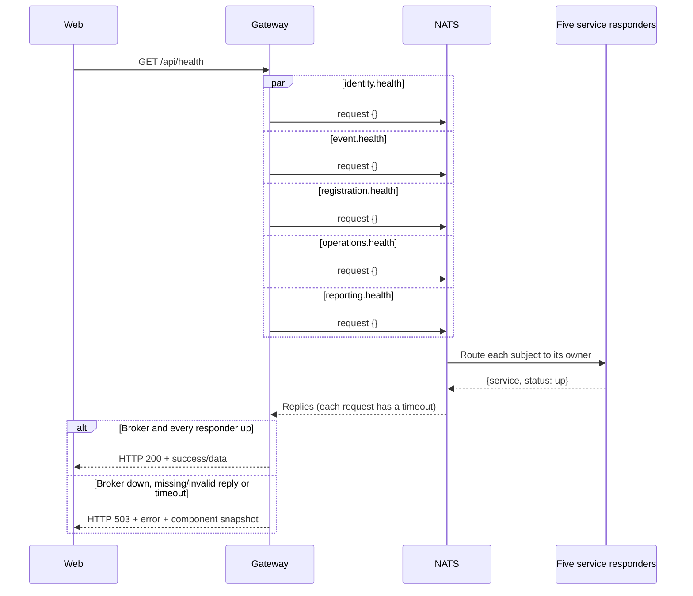

# Platform health sequence

```mermaid
sequenceDiagram
  participant Web
  participant Gateway
  participant NATS
  participant Services as Five service responders
  Web->>Gateway: GET /api/health
  par identity.health
    Gateway->>NATS: request {}
  and event.health
    Gateway->>NATS: request {}
  and registration.health
    Gateway->>NATS: request {}
  and operations.health
    Gateway->>NATS: request {}
  and reporting.health
    Gateway->>NATS: request {}
  end
  NATS->>Services: Route each subject to its owner
  Services-->>NATS: {service, status: up}
  NATS-->>Gateway: Replies (each request has a timeout)
  alt Broker and every responder up
    Gateway-->>Web: HTTP 200 + success/data
  else Broker down, missing/invalid reply or timeout
    Gateway-->>Web: HTTP 503 + error + component snapshot
  end
```

Timeout/service failure được cô lập trong từng request. Gateway tiếp tục nhận HTTP requests. Không query database trong health flow.
