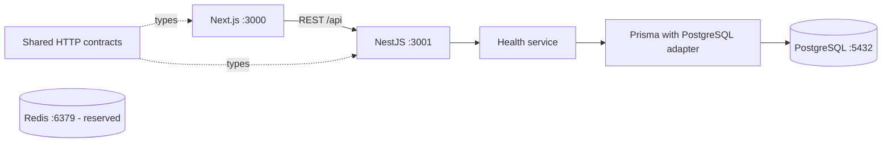

# Architecture

The existing Git checkout is the monorepo root; do not add another nested repository.
Business features later follow Controller → Service → Repository → Prisma.
The infrastructure health service uses Prisma directly because it has no business queries.

Next route groups do not change URLs. Use `(public)/events` for `/events`, and
`(dashboard)/dashboard/events` for `/dashboard/events`, avoiding conflicting routes.
Pages compose feature components. TanStack Query owns server state. Add Zustand only
when client UI state needs it, and React Hook Form + Zod with Phase 1 forms.

Prisma 7 uses `prisma.config.ts`, a generated client outside node_modules, and
`@prisma/adapter-pg`. The generated client is server-only and ignored by Git.
See [Prisma's official guide](https://www.prisma.io/docs/guides/upgrade-prisma-orm/v7).
Next.js uses App Router and Tailwind CSS 4; lint runs explicitly, separate from build.
See [Next.js installation](https://nextjs.org/docs/app/getting-started/installation).

Redis is infrastructure only in Phase 0. BullMQ, Socket.IO, notifications, Cloudinary,
payments and AI are implemented in their designated phases, not scaffolded as fake services.
